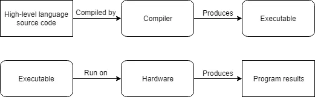
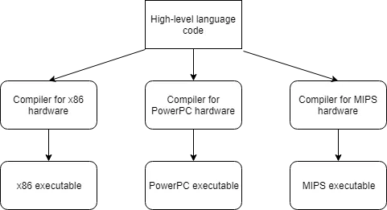

<h1> مقدمه‌ای بر زبان‌های برنامه‌نویسی </h1>

<div dir="rtl">
<p align="justify">
کامپیوترهای مدرن به طرز شگفت‌انگیزی سریعن و در حال سریعتر شدن هم هستن. اگهرچه کامپیوترها محدودیت‌ها مهمی دارن: به صورت ذاتی! (natively) فقط تعداد محدودی دستور رو میفهمن و باید خیلی دقیق بهشون بگی که چیکار کنن.


یک **برنامه کامپیوتری** (که بهش **اپلیکیشن** میگن) یه مجموعه دستورالعمله که کامپیوتر میتونه برای انجام یه وظیفه خاص اجراشون کنه. فرآیند ساخت این برنامه اسمش میشه **برنامه‌نویسی**. برنامه‌نویس‌ها معمولا با کدنویسی این برنامه‌‌ها رو تولید می کنن که یه لیستی از دستوراتیه که توی یک یا چند تا فایل تایپ میشه

اون بخش‌های فیزیکی کامپیوتر که کامپیوتر رو تشکیل میدن و برنامه‌ها رو اجرا می‌کنن اسمشون **سخت‌افزار** هست. وقتی برنامه توی حافظه بارگذاری شد و سخت‌افزار به طور متوالی (sequentially) شروع کرد به اجرای دستورالعمل‌ها، به این کار میگن اجرای برنامه (running or executing).
</p>


<h2> زبان ماشین </h2>
<p align="justify">
یک CPU قابلیت صحبت کردن با زبان C++ رو نداره. دستورات محدودی که CPU میتونه اونه رو بفهمه با نام کد ماشین یا زبان ماشین یا مجموعه دستورات شناخته میشن.
به عنوان مثال یک نمون از این دستورات: `10110000 01100001`
قدیم‌ها وقتی کامپیوتر تازه اختراع شده بود، برنامه‌نویس‌ها مجبور بودن مستقیما به زبان ماشین، که بسیار سخت و وقت‌گیر بود برنامه بنویسن.

اینکه چطور این دستورات کار می‌کنن فراتر از مباحث این آموزشه، اما ذکر دو مورد خالی از لطف نیست. اول، هر دستورالعمل از مجموعه‌ای از 0 و 1 تشکیل شده. هر کدوم از 0 یا 1 ها، یک **binary digit** یا به اختصار **bit** نامیده میشن.
تعداد بیت‌های تشکیل دهنده یک دستورالعمل یکسان نیست و برای هر CPU میتونه متفاوت باشه. به عنوان مثال بعضی CPU ها همیشه دستورالعمل‌هاشون 32 بیته در حالی که بعضیای دیگه دستورالعمل‌هایی دارن که طولشون میتونه متغیر باشه (مثل خونواده x86)
دوم، هر دستورالعمل باینری توسط CPU به یک command تفسیر میشه که یک کار خاصی رو انجام میده، مثل مقایسه دو عدد، یا جا گذاری یه عدد در یک قسمت حافظه. از اونجا که CPUها دستورالعمل‌های متفاوتی دارن، پس دستورالعملی که برای یک CPU نوشه شده
نمی‌تونه برای یه CPU دیگه که اون دستورالعمل رو نداره استفاده بشه. این جمله به این معنیه که در حالت کلی برنامه‌ها پرتابل (**Portable**) نیستن و نمی‌تونن توی سیستم‌‌های مختلف (بدون تغییرات خیلی زیاد) اجرا بشن و مجبوریم کل برنامه رو دوباره بنویسیم.
</p>

<h2> زبان اسمبلی </h2>

<p align="justify">
از اونجا که خوندن و نوشتن به زبان ماشین برای انسان خیلی سخت بود، زبان اسمبلی اختراع شد. در زبان اسمبلی هر دستور با یک کلمه مخفف (به جای مجموعه‌‌ای از بیت‌ها) مشخص میشه و میشه از نام‌ها و اعداد هم استفاده کرد.
به عنوان مثال: `mov al, 061h`
این کار باعث میشه اسمبلی خیلی خیلی بیشتر از زبان ماشین قابل خواندن و نوشتن باشه. از اونجا که CPU نمیتونه مستقیما زبان اسمبلی رو بفهمه، پس زبان اسمبلی باید به زبان ماشین ترجمه بشه. این کار رو برنامه ای به اسم **اسمبلر** (**assembler**) انجام میده.
برنامه‌های اسمبلی خیلی سریع اجرا میشن تا حدی که حتی امروزه هم اونجایی که سرعت حیاتیه از اسمبلی استفاده میشه.

مثل هر چیز دیگه‌ای اسمبلی هم یه یه روی تاریکی داره! اول اینکه برای انجام یه تسک ساده هم یه عالمه دستور باید بنویسیم. درسته که دستوراتش برای انسان خواناتره اما فهمیدن اینکه کل برنامه داره چیکار می‌کنه هنوز سخته (مثل اینه که بخوای یه جمله رو با نگاه به تک تک کلمات به صورت اختصاصی بفهمی)
دوم اینکه خیلی پرتابل نیست، برنامه‌ای که به زبان اسمبلی برای یه CPU نوشته شده معمولا روی یه CPU دیگه کار نمی‌‌کنه و باید از اول نوشته بشه.
</p>

<h2> برنامه‌های سطح بالا </h2>
<p align="justify">
برای رفع مشکل خوانایی و پرتابل بودن، زبان‌های جدیدی مثل C، C++ و Pascal (و اخیرا جاوا، جاوا اسکریپ و Perl و...) بوجود اومدن. این زبان‌‌ها زبان‌‌های سطح بالا (High-Level Languages) نامیده میشن که به برنامه‌نویس کمک می‌کنن برنامه‌ای بنویسن بدون نگرانی از اینکه 
قراره توی چه نوع کامپیوتری اجرا بشه.
به عنوان مثال در زبان C/C++: `a = 97;`
</p>

<p align="justify">
درست مثل زبان اسمبلی، برنامه‌‌هایی که با زبان‌های سطح بالا نوشته میشن هم لازمه ک به زبان ماشین ترجمه بشن تا بتونن اجرا بشن. دو راه (کلی) داریم: کامپایل کردن (Compiling) و تفسیر کردن (Interpreting)
</p>

<p align="justify">
**کامپایلر** برنامه‌ایه که سورس کد رو میخونه و یه فایلی ایجاد می‌کنه که میتونه اجرا بشه. وقتی این فایله ایجاد شد دیگه نیازی به کامپایلر نیست و خودش به تنهایی میتونه اجرا بشه.
اوایل که هنوز کامپایلرها تازه کار بودن، کدهای کند و غیربهینه تولید می‌کردن. به مرور زمان، کارشون اینقدر خوب شد و کدهای سریع و بهینه تولید کردن که تو بعضی موارد حتی کدهای اسمبلی بهتری از انسان تولید می‌کنن!

یک نمای ساده از فرآیند کامپایل:


 
 
از اونجایی که برنامه‌های C++ باید کامپایل بشن، در ادامه درباره کامپایلرها بیشتر توضیح میدیم.
</p>

<p align="justify">
**مفسر** برنامه‌ایه که دستورالعمل‌های موجود در سورس کد رو به صورت مستقیم اجرا می‌کنه بدون اینکه نیاز باشه کامپایل بشن. مفسرها از کامپایلرها انعطاف بیشتر اما بهره وری کمتر دارن چون فرآیند تفسیر هر بار که برنامه اجرا میشه باید طی بشه.
یعنی هر باری که برنامه می‌خواد اجرا بشه، به مفسر نیازه (مترجم: و مثل کامپایلر نیست که یه بار کامپایل کنه دیگه نیازی بهش نباشه)

یک نمای ساده از فرآیند تفسیر (Interpretation):


``` مطالعه اختیاری
یه مقایسه خوب بین کامپایلر و مفسر: <a href="https://stackoverflow.com/questions/38491212/difference-between-compiled-and-interpreted-languages/38491646#38491646">اینجا</a>
```

بیشتر زبون‌ها می‌تونن کامپایل یا تفسیر بشن. زبون‌های سنتی مثل C و C++ و پاسکال کامپایل میشن، در حالی که زبان‌های اسکریپتی مثل Perl و javascript تفسیر میشن. بعضی زبون‌ها مثل Java از ترکیب این دو روش استفاده می‌کنن.
</p>

<p align="justify">
زبان‌های سطح بالا خصوصیات سودمند زیاندی دارن
اول، کدنویسی به زبان سطح بالا و خوندن اون کد، خیلی راحت‌تره چون به زبان انسان نزدیکترن.
دوم، برای انجام یک تسک خاص، با زبان‌های سطح بالا تعداد دستورات کمتری نیاز هست نوشته بشن، که باعث میشه برنامه مختصر و قابل فهم‌تر بشه.
توی C++ میشه همچین دستوری رو توی یه خط نوشت: `a = b * 2 + 5;`. در حالی که همین کار توی اسمبلی باید با 5 ، 6 تا دستور نوشته بشه.

سوم، برنامه‌هایی که با زبان‌های سطح بالا نوشته میشن میتونن برای سیستم‌های مختلف کامپایل بشن (یا با مفسر تفسیر بشن) و شما مجبور نیستین برنامه رو تغییر بدین تا روی CPU های مختلف کار کنه (فقط برای اون CPU خاص کامپایلش می‌کنین)



البته دو تا مشکل سر راه قابل حمل بودن (Portability) وجود داره. اولیش اینه که بسیار از سیستم‌عامل‌ها مثل Microsoft Windows، یه سری قابلیت‌های مختص به خودشون رو دارن که شما می‌تونین توی کد ازشون استفاده کنین.
این کار باعث میشه برنامه نوشتن برای اون سیستم‌عامل خاص خیلی راحت‌تر بشه اما به قیمت از دست دادن قابل حمل بودن. در این سلسه آموزش، ما از هیچگونه کد مخصوص به سیستم‌عامل خاصی استفاده نمی‌کنیم.
دوم اینکه بعضی کامپایلرها از وصله‌های خاصی استفاده می‌کنن (extension) که باعث میشه کدتون فقط توی همون کامپایلر کامپایل بشه و کامپایلرهای دیگه نتونن کدتون رو کامپایل کنن. در این باره در ادامه بیشتر حرف خواهیم زد.
</p>

<h2> قوانین، Best Practice ها و هشدارها </h2>
<p align="justify">
در ادامه آموزش ما نکات مهم رو به این صورت دسته‌بندی می‌کنیم

> **Note** Rule
قوانین یا Rule ها، دستورالعمل‌هایی هستند که باید رعایت شوند چون الزامی توسط زبانی برنامه‌نویسی هستند. رعایت نکردن قوانین باعث میشه برنامه کار نکنه

> **Note** Best practice
Best practice ها چیزایی هستن که بهتره انجام بشن، چون به عنوان یه راه استاندارد پیشنهاد میشن. در واقع یا همه این راه رو میرن (و اگه شما نری داری یه کار غیرقابل انتظار می‌کنی)، یا این بهترین راهه.


> **Warning**
هشدارها چیزایی هستن که نباید انجام بدین چون نتایجی به بار میارن که قابل پیش‌بینی نیستن.

</p>


</div>